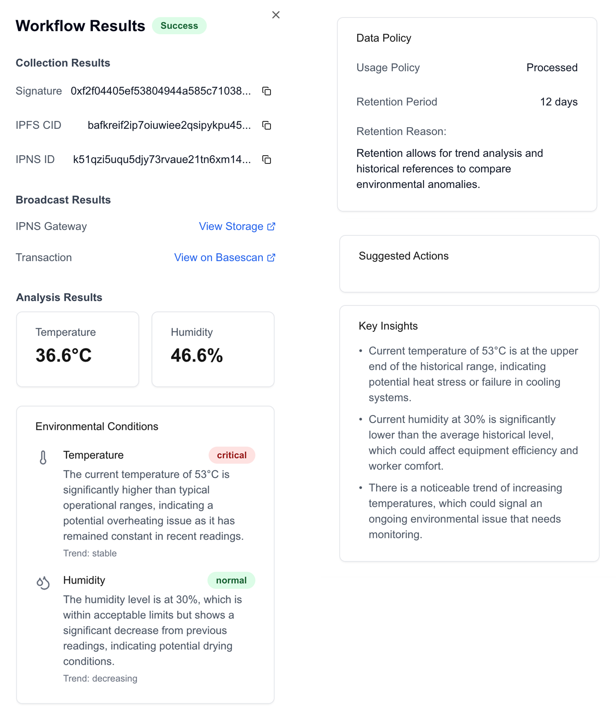

# Medusa Bridge

Orchestration layer for multi-head dePIN AI agents and Web3 infrastructure.

<!--  -->

## Core Architecture

### AI Agents ("Heads")

- **Collector**: Data collection and signing
- **Broadcaster**: IPNS/storage and state broadcasting
- **ResponseAgent**: Data analysis and policy determination

### Infrastructure

- Covalent Zee Agentkit: Agent orchestration
- Privy Server: Autonomous signing
- GreenField: storage
- Pimlico: Account Abstraction
- Binance Smart chain
- GPT-4: Agent intelligence
- CDP: Client bundling and RPC

## Key Features

- Multi-head architecture for specialized tasks
- Smart contract state synchronization (Medusa Registry)
- Policy-driven data analysis

\*Code formatting in progress...
